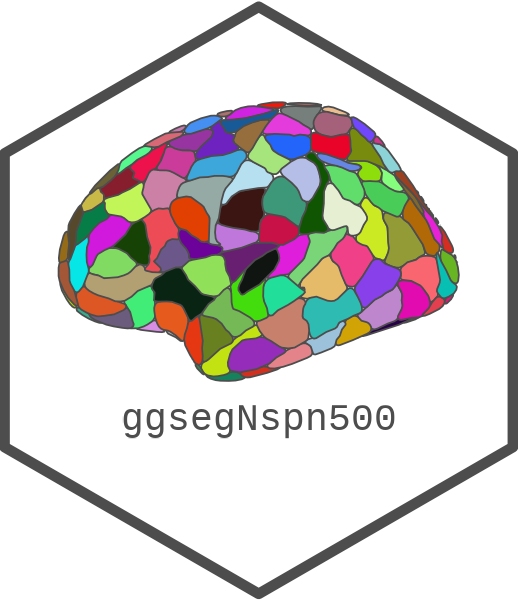

<!-- README.md is generated from README.qmd. Please edit that file -->

```{r}
#| label: setup
#| include: false
knitr::opts_chunk$set(
  collapse = TRUE,
  comment = "#>",
  fig.path = "man/figures/README-",
  out.width = "100%",
  fig.width = 10,
  fig.retina = 3
)
```

# ggsegNspn500 

<!-- badges: start -->
[](https://github.com/ggsegverse/ggsegNspn500/actions/workflows/R-CMD-check.yaml)
[](https://ggseg.r-universe.dev/ggsegNspn500)
<!-- badges: end -->

This package contains dataset for plotting the NSPN500 atlas for ggseg.

Whitaker KJ, Vertes PE, Romero-Garcia R, Vasa F, Moutoussis M, Prabhu G, ...
& Tait R (2016). Adolescence is associated with genomically patterned
consolidation of the hubs of the human brain connectome. *PNAS*, 113(32),
9105-9110.

Romero-Garcia R, Atienza M, Clemmensen LH, & Cantero JL (2012). Effects of
network resolution on topological properties of human neocortex. *Neuroimage*,
59(4), 3522-3532.

## Installation

We recommend installing the ggseg-atlases through the ggseg
[r-universe](https://ggseg.r-universe.dev/ui#builds):

```{r}
#| label: install-r-universe
#| eval: false
options(repos = c(
  ggseg = "https://ggseg.r-universe.dev",
  CRAN = "https://cloud.r-project.org"
))

install.packages("ggsegNspn500")
```

You can install this package from [GitHub](https://github.com/) with:

```r
# install.packages("pak")
pak::pak("ggsegverse/ggsegNspn500")
```

## NSPN500 atlas

```{r}
#| label: nspn500
#| fig-height: 12
library(ggseg)
library(ggsegNspn500)
library(ggplot2)

ggplot() +
  geom_brain(
    atlas = nspn500(),
    mapping = aes(fill = label),
    position = position_brain(hemi ~ view),
    show.legend = FALSE
  ) +
  scale_fill_manual(values = nspn500()$palette, na.value = "grey") +
  theme_void()
```

## Data source

Whitaker KJ, Vertes PE, Romero-Garcia R, Vasa F, Moutoussis M, Prabhu G, ...
& Tait R (2016). Adolescence is associated with genomically patterned
consolidation of the hubs of the human brain connectome. *PNAS*, 113(32),
9105-9110.
