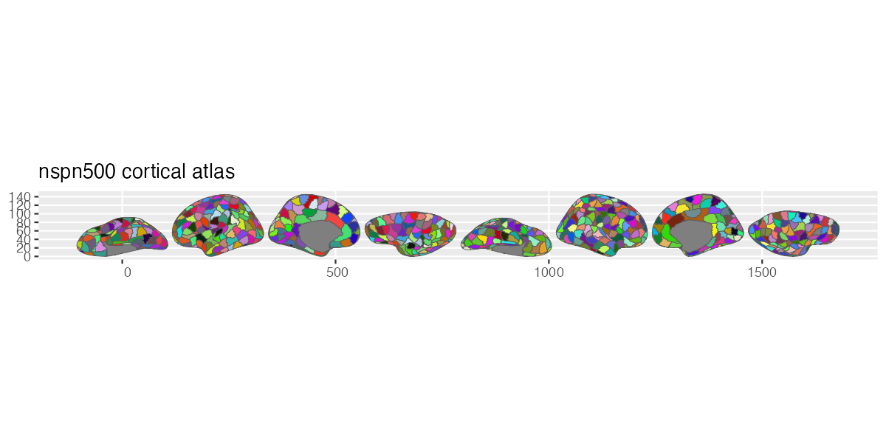

# ggsegNspn500

NSPN500 Cortical Atlas for the ggsegverse Ecosystem.

## Installation

``` r
# install.packages("remotes")
remotes::install_github("ggsegverse/ggsegNspn500")
```

## Usage

``` r
library(ggsegNspn500)
library(ggseg)

plot(nspn500()) +
  theme_brain()
```

## Atlas

### nspn500

NSPN500 cortical parcellation.



nspn500
