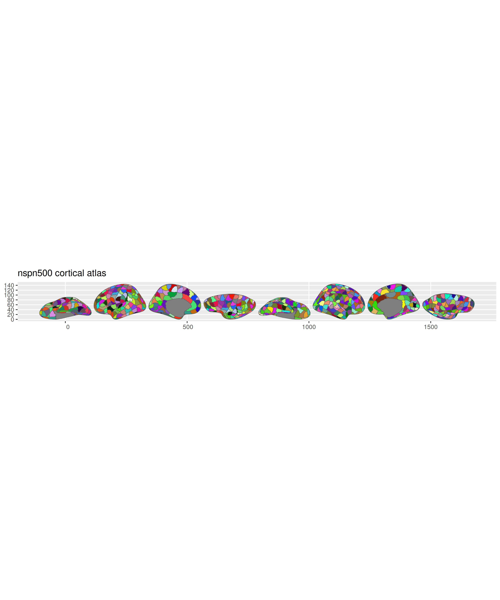

# ggsegNspn500

This package contains dataset for plotting the NSPN500 atlas for ggseg.

Whitaker KJ, Vertes PE, Romero-Garcia R, Vasa F, Moutoussis M, Prabhu G,
… & Tait R (2016). Adolescence is associated with genomically patterned
consolidation of the hubs of the human brain connectome. *PNAS*,
113(32), 9105-9110.

Romero-Garcia R, Atienza M, Clemmensen LH, & Cantero JL (2012). Effects
of network resolution on topological properties of human neocortex.
*Neuroimage*, 59(4), 3522-3532.

## Installation

We recommend installing the ggseg-atlases through the ggseg
[r-universe](https://ggseg.r-universe.dev/ui#builds):

``` r

options(repos = c(
  ggseg = "https://ggseg.r-universe.dev",
  CRAN = "https://cloud.r-project.org"
))

install.packages("ggsegNspn500")
```

You can install this package from [GitHub](https://github.com/) with:

``` r

# install.packages("pak")
pak::pak("ggsegverse/ggsegNspn500")
```

## NSPN500 atlas

``` r

library(ggseg)
library(ggsegNspn500)

plot(nspn500())
```



## Data source

Whitaker KJ, Vertes PE, Romero-Garcia R, Vasa F, Moutoussis M, Prabhu G,
… & Tait R (2016). Adolescence is associated with genomically patterned
consolidation of the hubs of the human brain connectome. *PNAS*,
113(32), 9105-9110.
